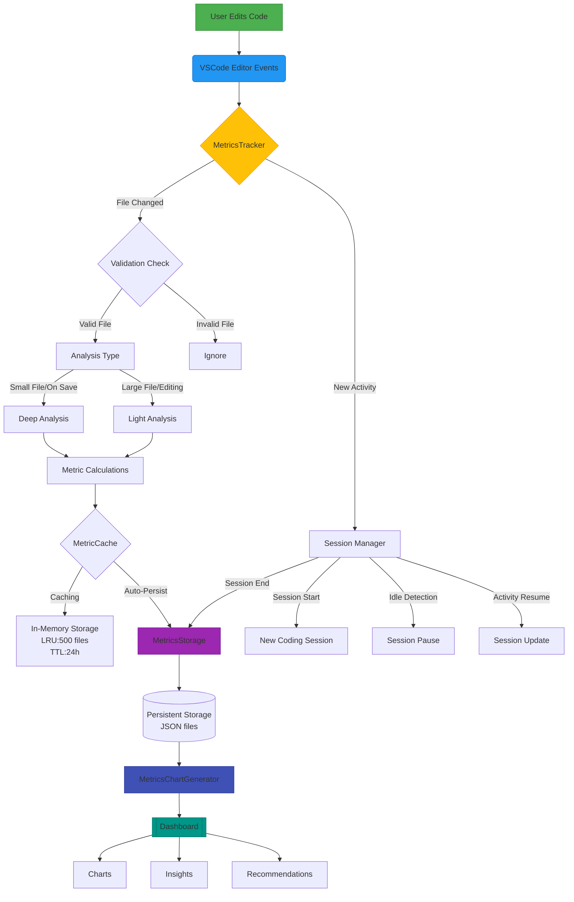

#

```mermaid
    graph TD
    A[User Edits Code] --> B(VSCode Editor Events)
    B --> C{MetricsTracker}
    C -->|New Activity| D[Session Manager]
    C -->|File Changed| E{Validation Check}
    E -->|Valid File| F[Analysis Type]
    E -->|Invalid File| G[Ignore]
    F -->|Small File/On Save| H[Deep Analysis]
    F -->|Large File/Editing| I[Light Analysis]
    H --> J[Metric Calculations]
    I --> J
    J --> K{MetricCache}
    K -->|Caching| L[In-Memory Storage<br>LRU:500 files<br>TTL:24h]
    K -->|Auto-Persist| M[MetricsStorage]
    M --> N[(Persistent Storage<br>JSON files)]
    N --> O[MetricsChartGenerator]
    O --> P[[Dashboard]]
    P --> Q[Charts]
    P --> R[Insights]
    P --> S[Recommendations]

    D -->|Session Start| T[New Coding Session]
    D -->|Idle Detection| U[Session Pause]
    D -->|Activity Resume| V[Session Update]
    D -->|Session End| M
    
    style A fill:#4CAF50,stroke:#388E3C
    style B fill:#2196F3,stroke:#1976D2
    style C fill:#FFC107,stroke:#FFA000
    style M fill:#9C27B0,stroke:#7B1FA2
    style O fill:#3F51B5,stroke:#303F9F
    style P fill:#009688,stroke:#00796B
```
