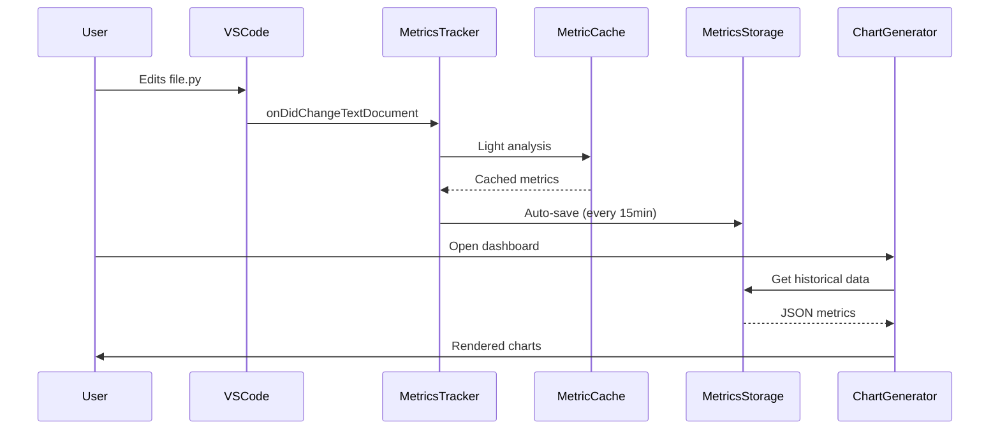

# Code Pulse Architecture Documentation

## 1. Data Flow Pipeline


### 1.1 Raw Code Interactions → Metric Collection

- **Trigger**: User edits (keystrokes), file saves, tab changes
- **Process**:

  ```mermaid
  graph LR
    A[Editor Event] --> B{File Valid?}
    B -->|Yes| C[MetricTracker]
    B -->|No| D[Ignore]
    C --> E[Light/Deep Analysis]
  ```

- **Validation Checks**:
  - File extension in allowed languages
  - File size < 50KB for deep analysis
  - Not in excluded patterns (configurable)

### 1.2 Metric Storage

- **Cache Layer** (MetricCache):

  ```typescript
  interface CacheEntry {
    data: FileMetrics;
    timestamp: number; // Last update time
  }
  ```

  - LRU eviction (max 500 files)
  - 24h expiration
  
- **Persistent Storage** (MetricsStorage):

  ```typescript
  interface StoredMetrics {
    daily: DailyMetrics[];
    files: Record<string, FileMetrics>;
    sessions: CodingSession[]; 
  }
  ```

  - Auto-saves every 15 minutes
  - Full save on extension deactivation

### 1.3 Visualization

- **Chart Generator Workflow**:
  1. Query MetricsStorage for date range
  2. Aggregate language statistics
  3. Calculate complexity trends
  4. Generate Chart.js configs
  5. Render responsive HTML/CSS

---

## 2. Core Component Interactions

### 2.1 Sequence Diagram



### 2.2 Component Matrix

| Component | Responsibility | Key Methods |
|-----------|----------------|-------------|
| `MetricsTracker` | Event handling | `handleEdit()`, `trackSession()` |
| `MetricCache` | Temporary storage | `get()`, `set()`, `prune()` |
| `MetricsStorage` | Persistent storage | `save()`, `load()`, `pruneOld()` |
| `ChartGenerator` | Visualization | `renderLanguageChart()`, `makeTooltip()` |

---

## 3. Analysis Types

### 3.1 Light Analysis (Quick)

```typescript
// tracker.ts
function quickAnalyze(content: string): ComplexityMetrics {
  const lines = content.split('\n');
  return {
    complexity: Math.min(20, lines.length / 50),
    // ...other metrics
  };
}
```

- **Triggers**:
  - File > 500 lines
  - During typing (debounced)
  
### 3.2 Deep Analysis

```typescript
// complexity.ts
function fullAnalyze(content: string, lang: string) {
  if(lang === 'python') return analyzePythonAST(content);
  if(lang === 'typescript') return analyzeTSCompiler(content);
  return fallbackRegexAnalysis(content);
}
```

- **Triggers**:
  - On file save
  - Manual dashboard refresh
  - First open of large file

---

## 4. Session Management

### 4.1 Lifecycle Rules

```typescript
interface CodingSession {
  start: number; // Timestamp
  end?: number;
  activeMinutes: number;
  idleMinutes: number;
  files: string[];
}
```

- **Start**: First edit after 5+ minutes idle
- **End**: 30 minutes of inactivity
- **Data Captured**:
  - Active vs idle time
  - Files touched
  - Language distribution

### 4.2 Idle Detection

```javascript
// tracker.ts
let lastAction = Date.now();

setInterval(() => {
  if(Date.now() - lastAction > 300_000) { // 5m
    currentSession.idleMinutes += 5;
  }
}, 60_000); // Check every minute
```

---

## 5. Performance Safeguards

### 5.1 Analysis Limits

| File Size | Analysis Type | Complexity Cap |
|-----------|---------------|----------------|
| <100 KB   | Deep          | 100            |
| 100-500KB | Light         | 20             |
| >500KB    | Skipped       | N/A            |

### 5.2 Memory Management

- Cache limit: 500 files
- Storage pruning: Auto-delete >90 day old data
- AST analysis timeout: 2s max per file
